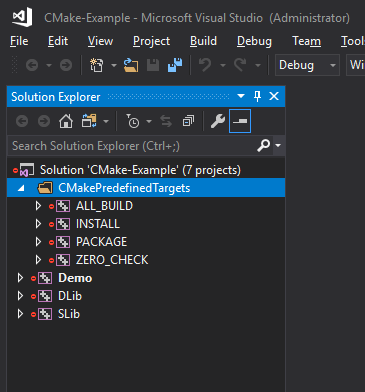

# This CMake Example

This is simple CMake Example.

It doesn't contain any wise C++ code, it shows how to use CMake, in particular:
- create Static library (StaticLib.lib)
- create Dynamic library (DynamicLib.dll)
- provide demo application which use both libraries (Demo.exe)
- Install feature, which install all 3 components (Demo.exe, StaticLib.lib, DynamicLib.dll and headers) on machine where CMake Install is executed (CMake Install)
- Installation Package (single file (.exe, .7z, .zip etc.)) that contain above components, so program could be distributed and installed on other machines (CPack)

# Prerequisites:

- CMake [https://cmake.org/download/](https://cmake.org/download/)
- NSIS Installer [http://nsis.sourceforge.net/Download](http://nsis.sourceforge.net/Download)
- Compiler e.g. Visual Studio 2017 Community [https://www.visualstudio.com/downloads/](https://www.visualstudio.com/downloads/)

# To run this example:

- download repository on your hard-disk
- in the downloaded folder, in command line run `cmake -Bbuild`.
This will create `build` directory and solution (*.sln) in it.
Then run `cmake --build build --config Release` in windows command line to compile.
- Alternatively you can open generated *.sln in Visual Studio - then you should see something like that:



- the other option is just open CMakeLists.txt directly in Visual Studio 2017 (Menu -> File -> Open -> CMake...)

## Quick command sequence to build all

... into build directory `./b/`:

```sh
cmake -Bb
cmake --build b --config Release
```

# To Do:

- Generating export macro automatically by CMake 
- Debugging StaticLib.lib and DynamicLib.dll through running Demo.exe
- Source Package (to distribute sources)
- GoogleTests integration (to test StaticLib and DynamicLib code)
- Building-in version number to StaticLib.lib and DynamicLib.dll (from CMake)
